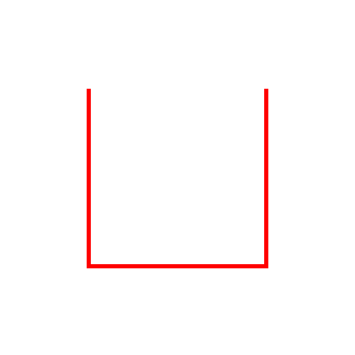
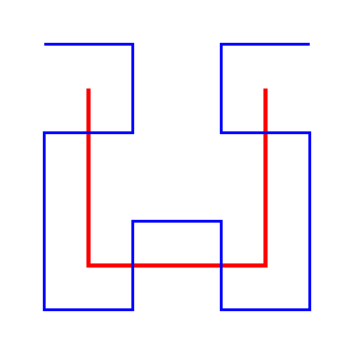

class: center, middle

# Hilly Sounds
### Cassaundra Smith and Kitt Zwovic
### CS 410 and 410P

---

class: center, middle

## What is Hilly Sounds?

???

Hilly Sounds is:
- A novel system for
  - Encoding arbitrary sound samples into images, and
  - decoding those images back into sound samples.

---

## Hilbert curve

<figure class="image-container">
    

        
        
        
    

    <figcaption>Hilbert Curve, first to third orders</figcaption>
</figure>

- Space filling curve discovered by mathematician David Hilbert.
- Based on simple production rules that can be applied repeatedly.
- Fills \\(n\\)-dimensional space when taken to its limit.
- For \\(k\\) iterations for \\(n=2\\), we get a grid with side length \\(2^{k}\\).

???

- In order to achieve this...
- A one-dimensional stream of sound samples is transformed into two dimensions through the use of a Hilbert curve.
- A Hilbert curve is a space filling curve discovered by German mathematician David Hilbert in 1891.
- Based on simple production rules that can be applied repeatedly.
  - (easy to compute on a computer)
- Fills \\(n\\)-dimensional space when taken to its limit.
  - (allows for arbitrarily large sizes)
- For \\(k\\) iterations for \\(n=2\\), we get a grid with side length \\(2^{k}\\).
  - (computer-friendly image sizes)

---

## Encoding and decoding

Assume we are dealing with RGB color space in a two-dimensional image.
We are given a color mapping \\(C : \mathbb{R} \to \mathbb{R}^{3}\\) and space mapping \\(S : \mathbb{R} \to \mathbb{R}^2 \\), as well as the inverse color functions \\(C^{-1} : \mathbb{R}^{3} \to \mathbb{R}\\).

**Encoding**

For each sound sample \\(s\\) at time \\(t\\),

1. Convert the sample to a color \\((r, g, b)\\) by \\(C(s)\\).
2. Find the corresponding position \\((x, y)\\) by \\(S(t)\\).
3. Write the color to the position in the image.

**Decoding**

To find the sound sample \\(s\\) at time \\(t\\):
1. Find the corresponding position \\((x, y)\\) by \\(S(t)\\).
2. Read the pixel \\((r, g, b)\\) from the image at that position.
3. Convert the pixel data to the sample \\(s\\) by \\(C^{-1}(r, g, b)\\).

---

## Demo (music)

<figure>
    
    <audio
        controls
        src="/sounds/fun_maker.wav">
            Your browser does not support the
            <code>audio</code> element.
    </audio>
</figure>

---

## Demo (music, low contrast)

<figure>
    
    <audio
        controls
        src="/sounds/fun_maker_low_contrast.wav">
            Your browser does not support the
            <code>audio</code> element.
    </audio>
</figure>

---

## Demo (music, flipped horizontally)

<figure>
    
    <audio
        controls
        src="/sounds/fun_maker_flipped.wav">
            Your browser does not support the
            <code>audio</code> element.
    </audio>
</figure>

---

## Demo (noise)

<figure>
    
    <audio
        controls
        src="/sounds/perlin.wav">
            Your browser does not support the
            <code>audio</code> element.
    </audio>
</figure>

---

## Demo (noise, blurred)

<figure>
    
    <audio
        controls
        src="/sounds/perlin-blur-4px.wav">
            Your browser does not support the
            <code>audio</code> element.
    </audio>
</figure>

---

## Demo (sinusoidal)

<figure>
    
    <audio
        controls
        src="/sounds/sinusoidal-large.wav">
            Your browser does not support the
            <code>audio</code> element.
    </audio>
</figure>

---

## Future work

- Frequency domain instead of time domain.
- Color strategy:
  - Use other color spaces besides HSV.
  - User-specified gradients.
- Space strategy:
  - Higher dimensions of curves.g. time as the third dimension).
  - Other space-filling curves (e.g. Moore curve).

---

## Implementation

- Written in Rust, currently available at https://github.com/kittcass/hilly-sounds.
- Still a work in progress, but very usable now.
- Fully fleshed out CLI, with bash/zsh/fish autocompletion.

---

## Credits

- [Fun Maker by ROADTOMUSIC](https://tunetank.com/tracks/5566-fun-maker/)
  (provided by Tunetank.com)
- "Hilbert Curve, first to third orders" by Geoff Richards, public domain

---

class: center, middle

## Questions?
